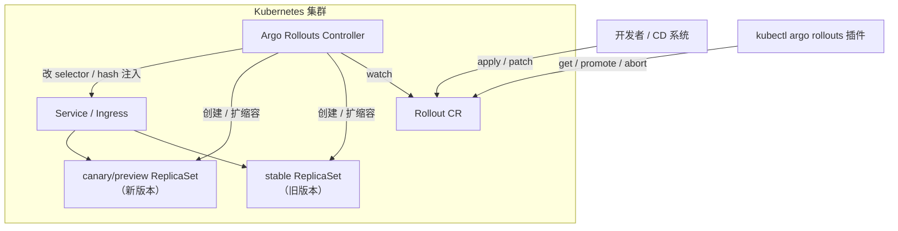
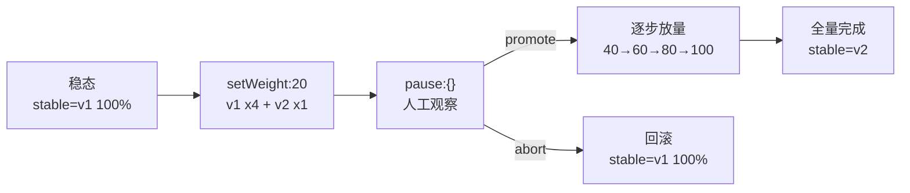
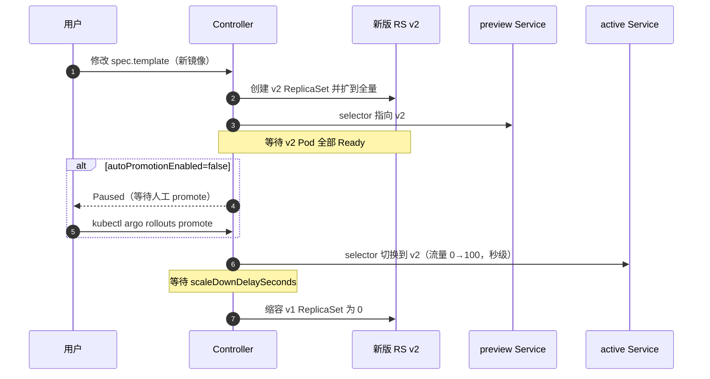
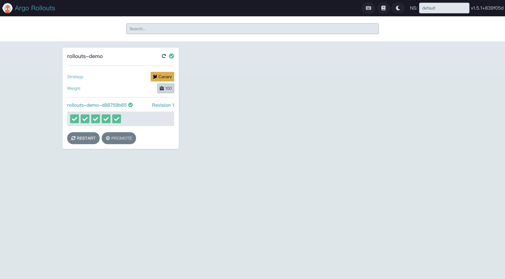
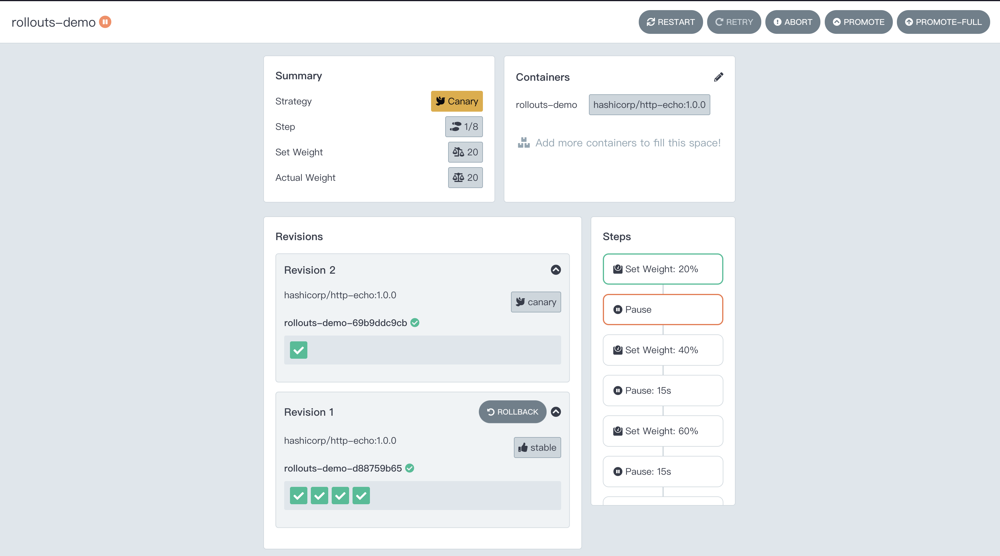
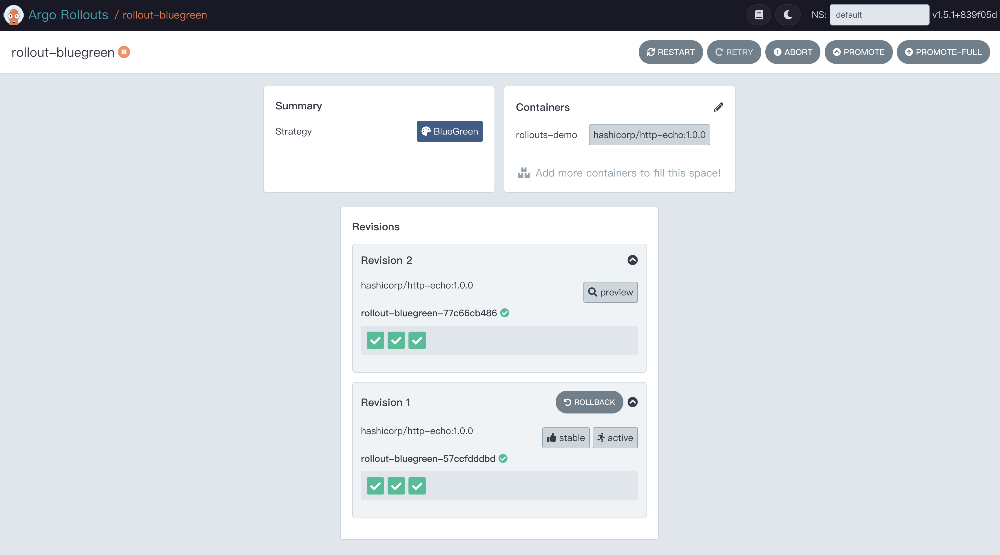

# Argo Rollouts 入门教程

> 环境：Kubernetes v1.23.3 + Argo Rollouts v1.5.1（本文 yaml 均在 [yaml/](./yaml/) 目录）
>
> 定位：入门上手，只覆盖 **安装、金丝雀、蓝绿** 两条主线。分析（Analysis）、Ingress 精确切流等进阶内容以后再补。

---

## 目录

- [一、介绍](#一介绍)
- [二、安装方式](#二安装方式)
  - [2.1 安装控制器](#21-安装控制器)
  - [2.2 安装 kubectl 插件](#22-安装-kubectl-插件)
  - [2.3 验证安装](#23-验证安装)
- [三、金丝雀部署（Canary）](#三金丝雀部署canary)
  - [3.1 原理](#31-原理)
  - [3.2 部署 Rollout](#32-部署-rollout)
  - [3.3 触发更新](#33-触发更新)
  - [3.4 观察与晋级](#34-观察与晋级)
  - [3.5 中止回滚](#35-中止回滚)
  - [3.6 验证流量比例](#36-验证流量比例)
- [四、蓝绿部署（BlueGreen）](#四蓝绿部署bluegreen)
  - [4.1 原理](#41-原理)
  - [4.2 部署与触发更新](#42-部署与触发更新)
  - [4.3 验证 preview 并切流](#43-验证-preview-并切流)
  - [4.4 回滚](#44-回滚)
- [五、Dashboard 可视化操作](#五dashboard-可视化操作)
  - [5.1 启动与访问](#51-启动与访问)
  - [5.2 列表页与详情页](#52-列表页与详情页)
  - [5.3 操作按钮与 kubectl 命令对照](#53-操作按钮与-kubectl-命令对照)
- [六、小结](#六小结)

---

## 一、介绍

**Argo Rollouts 是什么**：一个 Kubernetes 控制器 + 一组 CRD，用来替代 Deployment 做**金丝雀（Canary）**和**蓝绿（BlueGreen）**发布——核心能力是"逐步放量 + 出问题快速回退"，即**渐进式交付（Progressive Delivery）**。

和原生 Deployment 对比，它补上了两个关键短板：

| 对比维度 | Deployment（K8s 原生） | Rollout（Argo Rollouts） |
|---|---|---|
| 更新策略 | RollingUpdate / Recreate | Canary / BlueGreen |
| 流量控制 | 无（Pod 滚动替换） | 可按百分比渐进放量 |
| 中途暂停 | 不支持 | `pause` step 任意步骤暂停，等人工确认 |
| 一键回退 | `kubectl rollout undo`（重算 RS） | abort 秒级切回 stable（旧 RS 一直保留） |

三个关键认知：

1. **独立项目**：不依赖 Argo CD / Argo Workflows / Service Mesh，可单独安装使用；
2. **只管 Rollout 资源**：控制器对普通 Deployment 的变化完全无感，两者可在同一集群共存；
3. **与 Git 无关**：只关心集群里的 Rollout 对象变成什么样，不关心是谁改的（kubectl 手敲也行）。

核心 CRD 就一个：**Rollout**——Deployment 的等价替代，`spec.selector` + `spec.template` 字段完全同构，迁移只需三步：

1. `apiVersion: apps/v1` → `argoproj.io/v1alpha1`
2. `kind: Deployment` → `Rollout`
3. `strategy.rollingUpdate` → `strategy.canary`（或 `blueGreen`）



一句话工作原理：**Controller watch 所有 Rollout 对象，一旦 `spec.template` 变化（典型是镜像变了），就按 strategy 编排新旧 ReplicaSet 的扩缩容和 Service 的流量切换**。

---

## 二、安装方式

### 2.1 安装控制器

方式一：官方 install.yaml 直接装（本文采用）：

```bash
kubectl create namespace argo-rollouts
kubectl apply -n argo-rollouts -f https://github.com/argoproj/argo-rollouts/releases/download/v1.5.1/install.yaml
```

方式二：先把清单落到本地再 apply（教程场景推荐，可版本管理、可审计）：

```bash
curl -LO https://github.com/argoproj/argo-rollouts/releases/download/v1.5.1/install.yaml
kubectl create namespace argo-rollouts
kubectl apply -n argo-rollouts -f install.yaml
```

本文仓库里已保存了 v1.5.1 的完整清单：[yaml/v1.5.1.yaml](./yaml/v1.5.1.yaml)，可直接使用：

```bash
kubectl create namespace argo-rollouts
kubectl apply -n argo-rollouts -f yaml/v1.5.1.yaml
```

> 清单内容概览：5 个 CRD（Rollout / AnalysisRun / AnalysisTemplate / ClusterAnalysisTemplate / Experiment）+ ClusterRole/ClusterRoleBinding + 一个单副本 Deployment `argo-rollouts`（镜像 `quay.io/argoproj/argo-rollouts:v1.5.1`）+ metrics Service。清单本身**不包含 Namespace**，所以要先 `kubectl create namespace argo-rollouts`。

方式三：Helm（此处从略，见官方文档）。

### 2.2 安装 kubectl 插件

控制器装在集群里，日常观察和操作（get/promote/abort/dashboard）靠客户端的 kubectl 插件。

手动下载对应平台二进制（以 linux arm64 为例）：

```bash
curl -LO https://github.com/argoproj/argo-rollouts/releases/download/v1.5.1/kubectl-argo-rollouts-linux-arm64
chmod +x kubectl-argo-rollouts-linux-arm64
sudo mv kubectl-argo-rollouts-linux-arm64 /usr/local/bin/kubectl-argo-rollouts
```

> 插件只是读写 Rollout 对象的客户端工具，与控制器版本不必严格一致，但建议保持同版本。

### 2.3 验证安装

```bash
# 1. 控制器 Pod 正常运行
kubectl get pods -n argo-rollouts
# NAME                             READY   STATUS    RESTARTS   AGE
# argo-rollouts-577dd4d6bc-l2jwn   1/1     Running   0          3d4h

# 2. CRD 已注册
kubectl get crd | grep argoproj
# analysisruns.argoproj.io
# analysistemplates.argoproj.io
# clusteranalysistemplates.argoproj.io
# experiments.argoproj.io
# rollouts.argoproj.io

# 3. 插件可用
kubectl argo rollouts version
# kubectl-argo-rollouts: v1.5.1+839f05d
#   BuildDate: 2023-05-24T19:09:27Z
#   GitCommit: 839f05d46f838c04b44eff0e573227d40e89ac7d
#   GitTreeState: clean
#   GoVersion: go1.19.9
#   Compiler: gc
#   Platform: linux/arm64
```

---

## 三、金丝雀部署（Canary）

### 3.1 原理

新旧版本同时在线：新版本（canary）先接小比例流量，验证 OK 后逐步放量到 100%，全程旧版本（stable）兜底。

核心是 `steps` 编排，两个基础 step 类型：

- `setWeight: N`：canary 接收 N% 的流量；
- `pause: {}` / `pause: {duration: 15s}`：暂停；无 duration 无限期等人工 promote，有 duration 到时自动继续。

```yaml
strategy:
  canary:
    steps:
      - setWeight: 20
      - pause: {}                      # 人工确认
      - setWeight: 40
      - pause: {duration: 15s}         # 15s 后自动继续
      - setWeight: 60
      - pause: {duration: 15s}
      - setWeight: 80
      - pause: {duration: 15s}
      # 隐含：100% 全量，stable 切为新版
```

> ⚠️ **没有流量路由（trafficRouting）时，比例靠副本数近似**：5 副本 setWeight 20% → 1 新 4 旧；最小粒度受副本数限制（5 副本就是 20%）。精确到 1% 需接 Nginx/Istio 流量路由（进阶，本文不展开）。



### 3.2 部署 Rollout

> **演示镜像说明**：官方 `argoproj/rollouts-demo` 只发布 amd64 架构，arm64 节点会 `exec format error` 崩溃（我本地 Mac 虚拟机集群是 arm64）。本文统一用 **`hashicorp/http-echo:1.0.0`**（官方多架构 amd64/arm64），用 `-text=` 参数区分版本：blue → yellow → red，`curl` 返回对应文字，效果等价且更轻量。

完整清单：[yaml/canary-basic.yaml](./yaml/canary-basic.yaml)

```yaml
# canary-basic.yaml
apiVersion: v1
kind: Service
metadata:
  name: rollouts-demo
spec:
  ports:
    - port: 80
      targetPort: 8080
      protocol: TCP
  selector:
    app: rollouts-demo
---
apiVersion: argoproj.io/v1alpha1
kind: Rollout
metadata:
  name: rollouts-demo
spec:
  replicas: 5
  revisionHistoryLimit: 3
  selector:
    matchLabels:
      app: rollouts-demo
  template:
    metadata:
      labels:
        app: rollouts-demo
    spec:
      containers:
        - name: rollouts-demo
          image: hashicorp/http-echo:1.0.0
          args:
            - "-listen=:8080"
            - "-text=blue"                 # ← 版本标识在这，改它就触发新发布
          ports:
            - containerPort: 8080
  strategy:
    canary:
      steps:
        - setWeight: 20
        - pause: {}                 # 无限期暂停，等人工确认
        - setWeight: 40
        - pause: {duration: 15s}
        - setWeight: 60
        - pause: {duration: 15s}
        - setWeight: 80
        - pause: {duration: 15s}
```

部署并观察：

```bash
kubectl apply -f canary-basic.yaml
```

> 首次部署会**跳过所有 canary steps 直接拉满副本**（没有"旧版本"可渐进），与 Deployment 行为一致。

```shell
# 可视化观察（树状图：⟳Rollout #revision ⧉ReplicaSet □Pod）
kubectl argo rollouts get rollout rollouts-demo --watch

Name:            rollouts-demo
Namespace:       default
Status:          ✔ Healthy
Strategy:        Canary
  Step:          8/8
  SetWeight:     100
  ActualWeight:  100
Images:          hashicorp/http-echo:1.0.0 (stable)
Replicas:
  Desired:       5
  Current:       5
  Updated:       5
  Ready:         5
  Available:     5

NAME                                      KIND        STATUS     AGE  INFO
⟳ rollouts-demo                           Rollout     ✔ Healthy  15s
└──# revision:1
   └──⧉ rollouts-demo-d88759b65           ReplicaSet  ✔ Healthy  15s  stable
      ├──□ rollouts-demo-d88759b65-dffgs  Pod         ✔ Running  15s  ready:1/1
      ├──□ rollouts-demo-d88759b65-f49dz  Pod         ✔ Running  15s  ready:1/1
      ├──□ rollouts-demo-d88759b65-q8h6s  Pod         ✔ Running  15s  ready:1/1
      ├──□ rollouts-demo-d88759b65-r5vjq  Pod         ✔ Running  15s  ready:1/1
      └──□ rollouts-demo-d88759b65-v2jnh  Pod         ✔ Running  15s  ready:1/1
```

### 3.3 触发更新

http-echo 用 `-text` 区分版本，没有不同 tag，所以不用 `set image`，改用 `kubectl patch` 修改容器 args（效果一致：改动 `spec.template` → 触发新 revision）：

> ⚠️ **patch 必须带上 image**：`--type merge` 是 JSON Merge Patch，**数组是整体替换而非按 name 合并**。只写 `name`+`args` 会把 image 抹掉，报 `InvalidSpec: containers[0].image: Required value`、Rollout 变 Degraded。所以数组元素要么不改，要改就给全。

```bash
kubectl patch rollout rollouts-demo --type merge \
  -p '{"spec":{"template":{"spec":{"containers":[{"name":"rollouts-demo","image":"hashicorp/http-echo:1.0.0","args":["-listen=:8080","-text=yellow"]}]}}}}'
```

观察树状图：新 ReplicaSet（revision 2）创建，1 个新 Pod Ready 后进入 `pause`，状态变为 `Paused, canary pause step`。此时 5 副本 = 4 旧（blue）+ 1 新（yellow）≈ 20% 流量。

```shell
kubectl argo rollouts status rollouts-demo

Name:            rollouts-demo
Namespace:       default
Status:          ॥ Paused
Message:         CanaryPauseStep
Strategy:        Canary
  Step:          1/8
  SetWeight:     20
  ActualWeight:  20
Images:          hashicorp/http-echo:1.0.0 (canary, stable)
Replicas:
  Desired:       5
  Current:       5
  Updated:       1
  Ready:         5
  Available:     5

NAME                                       KIND        STATUS     AGE  INFO
⟳ rollouts-demo                            Rollout     ॥ Paused   94m
├──# revision:2
│  └──⧉ rollouts-demo-69b9ddc9cb           ReplicaSet  ✔ Healthy  12s  canary
│     └──□ rollouts-demo-69b9ddc9cb-lt8zv  Pod         ✔ Running  12s  ready:1/1
└──# revision:1
   └──⧉ rollouts-demo-d88759b65            ReplicaSet  ✔ Healthy  94m  stable
      ├──□ rollouts-demo-d88759b65-dffgs   Pod         ✔ Running  94m  ready:1/1
      ├──□ rollouts-demo-d88759b65-f49dz   Pod         ✔ Running  94m  ready:1/1
      ├──□ rollouts-demo-d88759b65-q8h6s   Pod         ✔ Running  94m  ready:1/1
      └──□ rollouts-demo-d88759b65-r5vjq   Pod         ✔ Running  94m  ready:1/1
```

### 3.4 观察与晋级

```bash
# 状态总览
kubectl argo rollouts status rollouts-demo
# Healthy / Paused, canary pause step / Degraded ...

# 晋级到下一步（跳过当前 pause）
kubectl argo rollouts promote rollouts-demo
# promote 后按 40→60→80 的 15s pause 自动推进到全量

# 直接全量（跳过剩余所有 steps）
kubectl argo rollouts promote rollouts-demo --full
```

最终状态

```shell
kubectl argo rollouts status rollouts-demo

Name:            rollouts-demo
Namespace:       default
Status:          ✔ Healthy
Strategy:        Canary
  Step:          8/8
  SetWeight:     100
  ActualWeight:  100
Images:          hashicorp/http-echo:1.0.0 (stable)
Replicas:
  Desired:       5
  Current:       5
  Updated:       5
  Ready:         5
  Available:     5

NAME                                       KIND        STATUS        AGE    INFO
⟳ rollouts-demo                            Rollout     ✔ Healthy     98m
├──# revision:2
│  └──⧉ rollouts-demo-69b9ddc9cb           ReplicaSet  ✔ Healthy     4m26s  stable
│     ├──□ rollouts-demo-69b9ddc9cb-lt8zv  Pod         ✔ Running     4m26s  ready:1/1
│     ├──□ rollouts-demo-69b9ddc9cb-mbwzt  Pod         ✔ Running     17s    ready:1/1
│     ├──□ rollouts-demo-69b9ddc9cb-t4tgv  Pod         ✔ Running     17s    ready:1/1
│     ├──□ rollouts-demo-69b9ddc9cb-xhv29  Pod         ✔ Running     17s    ready:1/1
│     └──□ rollouts-demo-69b9ddc9cb-bdt57  Pod         ✔ Running     16s    ready:1/1
└──# revision:1
   └──⧉ rollouts-demo-d88759b65            ReplicaSet  • ScaledDown  98m
```

### 3.5 中止回滚

再发一个 red 版本，这次在 Paused 时手动中止：

```bash
kubectl patch rollout rollouts-demo --type merge \
  -p '{"spec":{"template":{"spec":{"containers":[{"name":"rollouts-demo","image":"hashicorp/http-echo:1.0.0","args":["-listen=:8080","-text=red"]}]}}}}'

# 等 Paused 后：
kubectl argo rollouts abort rollouts-demo
```

abort 后：stable（yellow）副本拉满，canary 缩到 0，但 Rollout 状态是 **Degraded**（期望 red，实际运行 yellow）。恢复 Healthy 的正确姿势是**把期望改回 stable**（fast-track 回滚，跳过 steps）：

> ⚠️ **abort 不是严格秒级，回稳速度取决于 stable 当时的副本数**：基础金丝雀的权重靠副本数近似，stable 随 setWeight 逐步缩容（20% 时剩 4，80% 时只剩 1）。abort 时控制器要**先把 stable 扩回满副本**——新 Pod 调度、启动、就绪探针通过，需要几秒到几十秒；期间 canary Pod 仍在接流量，stable 扩够后才缩 0。看上面的输出：stable 里 AGE 24s 的新 Pod `xdwsd` 就是 abort 后补出来的（本文在 20% 处 abort 只补 1 个，所以快）。若在 80% 步骤 abort，要现补 4 个 Pod，体感明显变慢。**真正的秒级回稳是蓝绿（切 selector）和带流量路由的金丝雀（stable 全程满副本，只切权重）的特权**。

```shell
kubectl argo rollouts get rollout rollouts-demo --watch

Name:            rollouts-demo
Namespace:       default
Status:          ✖ Degraded
Message:         RolloutAborted: Rollout aborted update to revision 3
Strategy:        Canary
  Step:          0/8
  SetWeight:     0
  ActualWeight:  0
Images:          hashicorp/http-echo:1.0.0 (stable)
Replicas:
  Desired:       5
  Current:       5
  Updated:       0
  Ready:         5
  Available:     5

NAME                                       KIND        STATUS        AGE    INFO
⟳ rollouts-demo                            Rollout     ✖ Degraded    102m
├──# revision:3
│  └──⧉ rollouts-demo-7cdf9b8c57           ReplicaSet  • ScaledDown  96s    canary
├──# revision:2
│  └──⧉ rollouts-demo-69b9ddc9cb           ReplicaSet  ✔ Healthy     8m13s  stable
│     ├──□ rollouts-demo-69b9ddc9cb-lt8zv  Pod         ✔ Running     8m13s  ready:1/1
│     ├──□ rollouts-demo-69b9ddc9cb-mbwzt  Pod         ✔ Running     4m4s   ready:1/1
│     ├──□ rollouts-demo-69b9ddc9cb-t4tgv  Pod         ✔ Running     4m4s   ready:1/1
│     ├──□ rollouts-demo-69b9ddc9cb-xhv29  Pod         ✔ Running     4m4s   ready:1/1
│     └──□ rollouts-demo-69b9ddc9cb-xdwsd  Pod         ✔ Running     24s    ready:1/1
└──# revision:1
   └──⧉ rollouts-demo-d88759b65            ReplicaSet  • ScaledDown  102m
```

```bash
# 把 -text 改回 yellow（stable 版本），Rollout 立即变 Healthy，且不新建 RS
kubectl patch rollout rollouts-demo --type merge \
  -p '{"spec":{"template":{"spec":{"containers":[{"name":"rollouts-demo","image":"hashicorp/http-echo:1.0.0","args":["-listen=:8080","-text=yellow"]}]}}}}'
```

```shell
kubectl argo rollouts get rollout rollouts-demo --watch

Name:            rollouts-demo
Namespace:       default
Status:          ✔ Healthy
Strategy:        Canary
  Step:          8/8
  SetWeight:     100
  ActualWeight:  100
Images:          hashicorp/http-echo:1.0.0 (stable)
Replicas:
  Desired:       5
  Current:       5
  Updated:       5
  Ready:         5
  Available:     5

NAME                                       KIND        STATUS        AGE    INFO
⟳ rollouts-demo                            Rollout     ✔ Healthy     104m
├──# revision:4
│  └──⧉ rollouts-demo-69b9ddc9cb           ReplicaSet  ✔ Healthy     10m    stable
│     ├──□ rollouts-demo-69b9ddc9cb-lt8zv  Pod         ✔ Running     10m    ready:1/1
│     ├──□ rollouts-demo-69b9ddc9cb-mbwzt  Pod         ✔ Running     6m34s  ready:1/1
│     ├──□ rollouts-demo-69b9ddc9cb-t4tgv  Pod         ✔ Running     6m34s  ready:1/1
│     ├──□ rollouts-demo-69b9ddc9cb-xhv29  Pod         ✔ Running     6m34s  ready:1/1
│     └──□ rollouts-demo-69b9ddc9cb-xdwsd  Pod         ✔ Running     2m54s  ready:1/1
├──# revision:3
│  └──⧉ rollouts-demo-7cdf9b8c57           ReplicaSet  • ScaledDown  4m6s
└──# revision:1
   └──⧉ rollouts-demo-d88759b65            ReplicaSet  • ScaledDown  104m
```

### 3.6 验证流量比例

> **为什么不能用 `kubectl port-forward svc/xxx` 验证金丝雀比例**：port-forward 转发到 Service 时，kubectl 只会**选中 Service 背后的某一个 Pod 建立单一隧道**，所有请求都打在同一个 Pod 上，**完全绕过 kube-proxy 的负载均衡**。循环 curl 100 次也只会得到 100 个同色结果，永远看不到分流。

正确姿势：让流量**经过 Service（kube-proxy）**。**（最简）：在集群节点上直接 curl ClusterIP**

ssh 在 master/worker 节点上时，这是最短路径——节点属于集群网络，本机就有 kube-proxy 的分流规则：

```bash
kubectl get svc rollouts-demo
# TYPE        NAME           CLUSTER-IP      ...
# ClusterIP   rollouts-demo  10.99.228.141     ...

# 节点上压测 50 次并统计
for i in $(seq 50); do curl -s http://10.99.228.141; echo; done | sort | uniq -c
#   38 blue
#    12 yellow      ← ≈20% 金丝雀（5 副本 1 新 4 旧）
```

> ClusterIP 只在集群网络内可达——节点上、Pod 内可以 curl，自己的 Mac/笔记本上不行。

> 其它验证入口：NodePort / LoadBalancer / Ingress 入口发起请求同样经过 Service 分流，也有效。

---

## 四、蓝绿部署（BlueGreen）

### 4.1 原理

新版本整套拉起（preview），验证通过后**一次性**把流量从旧（active）切到新，观察一段时间无问题再缩容旧版本。流量切换 0→100 瞬间完成，不存在两版本同时接生产流量的窗口。

关键配置：

```yaml
strategy:
  blueGreen:
    activeService: rollout-bluegreen-active    # 必填，接生产流量
    previewService: rollout-bluegreen-preview  # 可选，预览新版本
    autoPromotionEnabled: false                # 默认 true：自动切流；false：等人工 promote
    scaleDownDelaySeconds: 120                 # 切流后旧 RS 保留时长，默认 30s
```

工作机制：控制器通过给两个 Service 的 selector **注入 ReplicaSet 的 pod-template-hash** 来控制流量指向——切流 = 改 active Service 的 selector hash，秒级生效。这也是为什么 yaml 里两个 Service 的 selector 写得完全一样，却各自只指向一个版本。



> 注意 `scaleDownDelaySeconds` 不是多此一举：Service selector 变更后各节点 iptables/ipvs 规则传播有延迟，保留旧 Pod 一段时间可防止流量打到已被杀的 Pod。

### 4.2 部署与触发更新

完整清单：[yaml/bluegreen.yaml](./yaml/bluegreen.yaml)

```yaml
# bluegreen.yaml
apiVersion: v1
kind: Service
metadata:
  name: rollout-bluegreen-active
spec:
  ports: [{port: 80, targetPort: 8080, protocol: TCP}]
  selector:
    app: rollout-bluegreen
---
apiVersion: v1
kind: Service
metadata:
  name: rollout-bluegreen-preview
spec:
  # selector 与 active 相同！控制器会注入 rollouts-pod-template-hash 精确区分
  ports: [{port: 80, targetPort: 8080, protocol: TCP}]
  selector:
    app: rollout-bluegreen
---
apiVersion: argoproj.io/v1alpha1
kind: Rollout
metadata:
  name: rollout-bluegreen
spec:
  replicas: 3
  selector:
    matchLabels:
      app: rollout-bluegreen
  template:
    metadata:
      labels:
        app: rollout-bluegreen
    spec:
      containers:
        - name: rollouts-demo
          image: hashicorp/http-echo:1.0.0
          args: ["-listen=:8080", "-text=blue"]
          ports: [{containerPort: 8080}]
  strategy:
    blueGreen:
      activeService: rollout-bluegreen-active
      previewService: rollout-bluegreen-preview
      autoPromotionEnabled: false   # 关键：切流前暂停，人工验证 preview
      scaleDownDelaySeconds: 120    # 切流后旧 RS 保留 2 分钟，便于快速回切
```

```bash
kubectl apply -f bluegreen.yaml
kubectl argo rollouts get rollout rollout-bluegreen --watch

# 首次部署：3 个 blue Pod 直接就绪，active Service 指向它们（首次部署无预览流程）

Name:            rollout-bluegreen
Namespace:       default
Status:          ✔ Healthy
Strategy:        BlueGreen
Images:          hashicorp/http-echo:1.0.0 (stable, active)
Replicas:
  Desired:       3
  Current:       3
  Updated:       3
  Ready:         3
  Available:     3

NAME                                           KIND        STATUS     AGE  INFO
⟳ rollout-bluegreen                            Rollout     ✔ Healthy  18s
└──# revision:1
   └──⧉ rollout-bluegreen-57ccfdddbd           ReplicaSet  ✔ Healthy  18s  stable,active
      ├──□ rollout-bluegreen-57ccfdddbd-24msp  Pod         ✔ Running  18s  ready:1/1
      ├──□ rollout-bluegreen-57ccfdddbd-2fvkg  Pod         ✔ Running  18s  ready:1/1
      └──□ rollout-bluegreen-57ccfdddbd-n57gf  Pod         ✔ Running  18s  ready:1/1
```

```shell
# 触发更新（green 版）
kubectl patch rollout rollout-bluegreen --type merge \
  -p '{"spec":{"template":{"spec":{"containers":[{"name":"rollouts-demo","image":"hashicorp/http-echo:1.0.0","args":["-listen=:8080","-text=green"]}]}}}}'

# 观察树状图：新 RS（revision 2）扩到 3 副本，preview Service 指向新 RS，
# active 仍指向旧 RS；就绪后进入 Paused（等待人工 promote）

kubectl argo rollouts get rollout rollout-bluegreen --watch

Name:            rollout-bluegreen
Namespace:       default
Status:          ॥ Paused
Message:         BlueGreenPause
Strategy:        BlueGreen
Images:          hashicorp/http-echo:1.0.0 (active, preview, stable)
Replicas:
  Desired:       3
  Current:       6
  Updated:       3
  Ready:         3
  Available:     3

NAME                                           KIND        STATUS     AGE    INFO
⟳ rollout-bluegreen                            Rollout     ॥ Paused   2m19s
├──# revision:2
│  └──⧉ rollout-bluegreen-77c66cb486           ReplicaSet  ✔ Healthy  10s    preview
│     ├──□ rollout-bluegreen-77c66cb486-4wknc  Pod         ✔ Running  10s    ready:1/1
│     ├──□ rollout-bluegreen-77c66cb486-d4m2s  Pod         ✔ Running  10s    ready:1/1
│     └──□ rollout-bluegreen-77c66cb486-hwlrm  Pod         ✔ Running  10s    ready:1/1
└──# revision:1
   └──⧉ rollout-bluegreen-57ccfdddbd           ReplicaSet  ✔ Healthy  2m19s  stable,active
      ├──□ rollout-bluegreen-57ccfdddbd-24msp  Pod         ✔ Running  2m19s  ready:1/1
      ├──□ rollout-bluegreen-57ccfdddbd-2fvkg  Pod         ✔ Running  2m19s  ready:1/1
      └──□ rollout-bluegreen-57ccfdddbd-n57gf  Pod         ✔ Running  2m19s  ready:1/1
```

### 4.3 验证 preview 并切流

**4.3.1 Service ClusterIP**

查看preview / active Service 如下：

```shell
kubectl get svc
# NAME                        TYPE        CLUSTER-IP      EXTERNAL-IP   PORT(S)   AGE
# kubernetes                  ClusterIP   10.96.0.1       <none>        443/TCP   115d
# rollout-bluegreen-active    ClusterIP   10.100.208.55   <none>        80/TCP    3m43s
# rollout-bluegreen-preview   ClusterIP   10.96.31.149    <none>        80/TCP    3m43s
```

```shell
curl -s http://10.100.208.55
# blue（旧版本）
curl -s http://10.96.31.149
# green（新版本）
```

**4.3.2 port-forward**

preview / active Service 的 selector 被 controller 注入了 pod-template-hash，各指向单一版本的 Pod，所以这两个 Service **可以**用 port-forward 验证（和金丝雀的普通 Service 不一样）：

```bash
# 终端 1：转发 preview（只有新版本 Pod）
kubectl port-forward svc/rollout-bluegreen-preview 8081:80
# 终端 2：转发 active（只有旧版本 Pod）
kubectl port-forward svc/rollout-bluegreen-active 8080:80

curl -s http://localhost:8081   # → green（新版本）
curl -s http://localhost:8080   # → blue（旧版本）

# 验证 OK 后切流
kubectl argo rollouts promote rollout-bluegreen
```

> ⚠️ **切流后，已建立的 port-forward 隧道不会跟着切**：隧道在建立时就**钉死在选中的那一个 Pod 上**，不跟随 Service selector 变化（原理同 3.6 的 port-forward 之坑）。所以切流后再 curl 8080：
>
> ```bash
> curl -s http://localhost:8080   # → 仍然是 blue！隧道还连着旧 Pod
> # 等 scaleDownDelaySeconds（120s）旧 Pod 被缩容后，这条隧道才直接断开
> ```
>
> 想**立刻**看到 active 切到新版本，两种方式：
>
> ```bash
> # 方式一：节点上 curl active 的 ClusterIP（走 kube-proxy，实时跟随 endpoints）
> curl -s http://10.100.208.55    # → green，瞬间切换
>
> # 方式二：Ctrl-C 掉旧的 port-forward 重新执行，新隧道会选中新版 Pod
> kubectl port-forward svc/rollout-bluegreen-active 8080:80
> curl -s http://localhost:8080   # → green
> ```

切流后：active Service selector 切到新 RS，流量瞬间 0→100；旧 RS 等 `scaleDownDelaySeconds`（120s）后缩为 0。

### 4.4 回滚

切流前发现 preview 有问题：

```bash
kubectl argo rollouts abort rollout-bluegreen
# active 仍指向旧 RS（从未切过去），新 RS 直接缩 0
# 之后同样要把 spec 改回 stable（-text=blue），消除 Degraded 状态
```

> 蓝绿的 abort 与金丝雀一致：期望版本与 stable 不一致 → Degraded；把 `spec.template` 改回 stable 内容即可恢复 Healthy（fast-track，不新建 RS）。

---

## 五、Dashboard 可视化操作

前面所有操作都靠 kubectl 插件命令完成，其实插件还自带一个 Web 控制台，鼠标点就能完成 promote/abort 等操作，观察发布过程也更直观。

### 5.1 启动与访问

```bash
kubectl argo rollouts dashboard
# INFO[0000] Argo Rollouts Dashboard is now available at http://localhost:3100/rollouts
```

命令默认监听 `0.0.0.0:3100`，子路径为 `/rollouts`。两个常用参数：

- `-p/--port`：改端口（默认 3100）
- `--root-path`：改子路径（默认 rollouts）

几种访问方式按场景选：

| 场景 | 访问方式 |
|---|---|
| 在能直连集群的 Mac 本机跑 | 浏览器直接开 `http://localhost:3100/rollouts` |
| 在 k8s 节点上跑（本文环境） | `http://<节点IP>:3100/rollouts`，替换成节点实际 IP |
| 远程节点，本机浏览器访问 | `ssh -L 3100:localhost:3100 <user>@<节点IP>` 后开 `http://localhost:3100/rollouts` |

```bash
# 本文：在节点上启动后，从 Mac 浏览器访问
kubectl argo rollouts dashboard
# INFO[0000] Argo Rollouts Dashboard is now available at http://localhost:3100/rollouts
# 浏览器打开 http://192.168.x.x:3100/rollouts（换成你的节点 IP）
```

> 两个注意点：
>
> 1. **它不是集群里的服务，而是插件进程**：dashboard 跑在你执行命令的那台机器上，用当前 kubeconfig 的凭证去查/改 Rollout 对象（Ctrl-C 退出即关停）。它不部署任何东西到集群里，安全边界等同于你手里的 kubeconfig，别在不信任的机器上跑。
> 2. **节点防火墙**：从 Mac 访问节点 IP 的 3100 端口，需确保节点防火墙（如 ufw/iptables）放行该端口，且 3100 不会暴露到公网。

### 5.2 列表页与详情页

打开后默认是 Rollout 列表页（顶部可切 namespace，只显示有 Rollout 的 namespace）：

- **列表页**：每行一个 Rollout，展示名称、策略（Canary/BlueGreen）、Stable/Canary/Preview 各 revision 的副本状态、状态与消息；行尾有 RESTART 和 PROMOTE 快捷按钮
- **详情页**：点击名称进入，和 `kubectl argo rollouts get rollout xxx --watch` 的树状图同源，但信息更全且自动刷新

详情页主要看这几块（对应 `--watch` 树状图各元素的可视化版本）：

| 区块 | 内容 |
|---|---|
| 左侧 Info | 状态/消息、策略、当前 Step（如 1/8）、SetWeight/ActualWeight、镜像列表（含 stable/canary 标签） |
| Steps（金丝雀） | 每个 step 一张卡片：已完成打勾、当前高亮、未开始置灰；`pause` 无 duration 的会显示持续等待 |
| Containers | 容器名 + 当前镜像；点铅笔图标可直接改镜像（等价 `kubectl argo rollouts set image`），改完 SAVE 触发新 revision |
| Revisions | 每个 revision 一张卡片，展开看 ReplicaSet/Pod 状态；**非当前 revision 右上有 ROLLBACK 按钮**（等价 `kubectl argo rollouts undo`） |

列表页：

<!-- TODO: 截图 dashboard 列表页，替换此占位 -->



金丝雀 Paused 时的详情页，左侧 Info + Steps + 操作按钮：

<!-- TODO: 截图金丝雀 Paused 详情页，替换此占位 -->



蓝绿 preview 就绪后的详情页，两个 Service 对应两套 Pod：



### 5.3 操作按钮与 kubectl 命令对照

详情页右上角一排操作按钮，每个点击后都有二次确认弹窗。它们和 kubectl 命令的对应关系（v1.5.1 共 5 个）：

| 按钮 | 等价命令 | 何时可用 | 作用 |
|---|---|---|---|
| RESTART | `kubectl argo rollouts restart` | 任意时刻 | 滚动重启所有 Pod（打 restartedAt 注解） |
| RETRY | `kubectl argo rollouts retry` | 仅 Degraded 时 | 清除 Degraded 状态重试当前 revision |
| ABORT | `kubectl argo rollouts abort` | 仅 Progressing/Paused 时 | 中止本次发布，切回 stable（见 3.5/4.4） |
| PROMOTE | `kubectl argo rollouts promote` | 仅 Progressing/Paused 时 | 跳过当前 pause/analysis step，进入下一步（见 3.4） |
| PROMOTE-FULL | `kubectl argo rollouts promote --full` | 仅 Progressing/Paused 时 | 跳过剩余所有 steps，宜接全量 |

> 按钮**不是随时都能点**：前端按 Rollout 状态动态置灰。比如 Healthy 稳态时 ABORT/PROMOTE 都是灰的（没有进行中的发布可操作）；Paused 时 PROMOTE/PROMOTE-FULL/ABORT 亮起——想在页面上体验 3.4/3.5 的晋级/中止流程，先 patch 触发一次更新让 Rollout 进入 Paused 即可。

配合前面章节的实战，页面上可以这样玩：

1. patch 触发 yellow 版发布 → 详情页 Steps 卡片逐个亮起，到 `pause {}` 停住
2. 点 PROMOTE → 跳到下一个 step，后续 15s pause 自动推进
3. 再 patch 一个 red 版，Paused 时点 ABORT → 状态变 Degraded，Revisions 里 canary 卡片缩容为 0
4. 非当前 revision 点 ROLLBACK / 或改回 spec，观察状态恢复 Healthy

---

## 六、小结

- **Rollout 是 Deployment 的超集替代**：selector + template 同构，迁移成本低；
- **金丝雀**：`setWeight` + `pause` 编排渐进放量，无 trafficRouting 时比例靠副本数近似（5 副本 → 20% 粒度）；
- **蓝绿**：preview 整套拉起 → 人工/自动 promote 一次性切流 → 延迟缩容旧版本；两个 Service selector 相同，靠控制器注入 hash 区分；
- **abort 是最快的回退**：蓝绿（切 selector）与带流量路由的金丝雀（stable 全程满副本，权重瞬间切回）可秒级回稳；基础金丝雀的 stable 已随步骤缩容，abort 要先扩回满副本（几秒~几十秒，取决于 Pod 启动/就绪速度）。回稳后记得把 spec 改回 stable 内容消除 Degraded；
- **验证金丝雀比例不能用 port-forward**（单 Pod 隧道绕过负载均衡），要走 Service/ClusterIP。

下一步可以玩的：Analysis（对接 Prometheus 自动判定晋级/回滚）、Nginx Ingress 精确流量切分（trafficRouting）。
